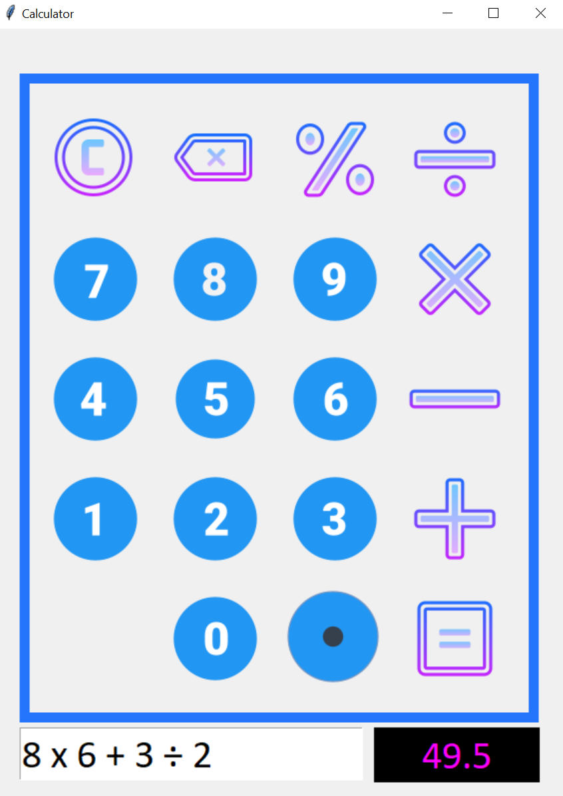
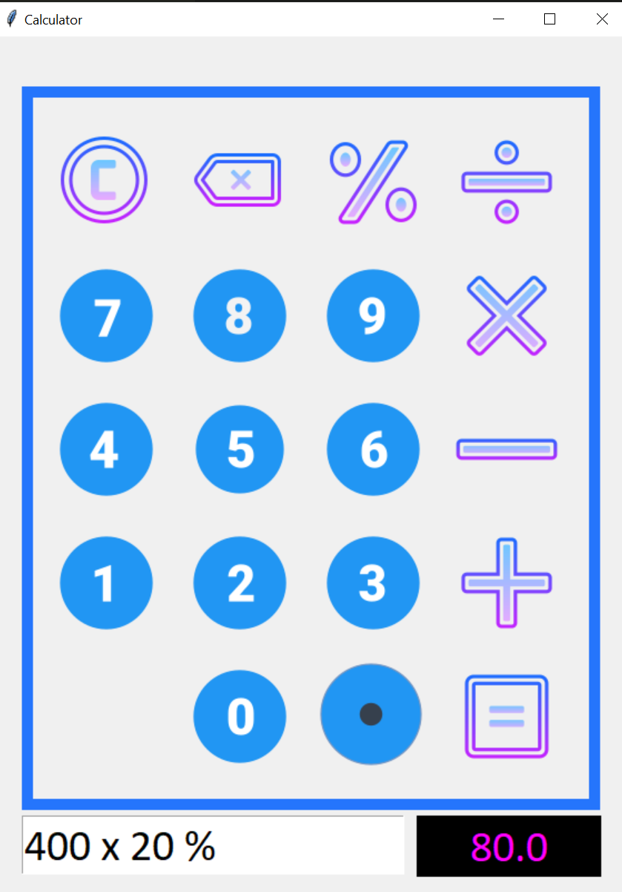
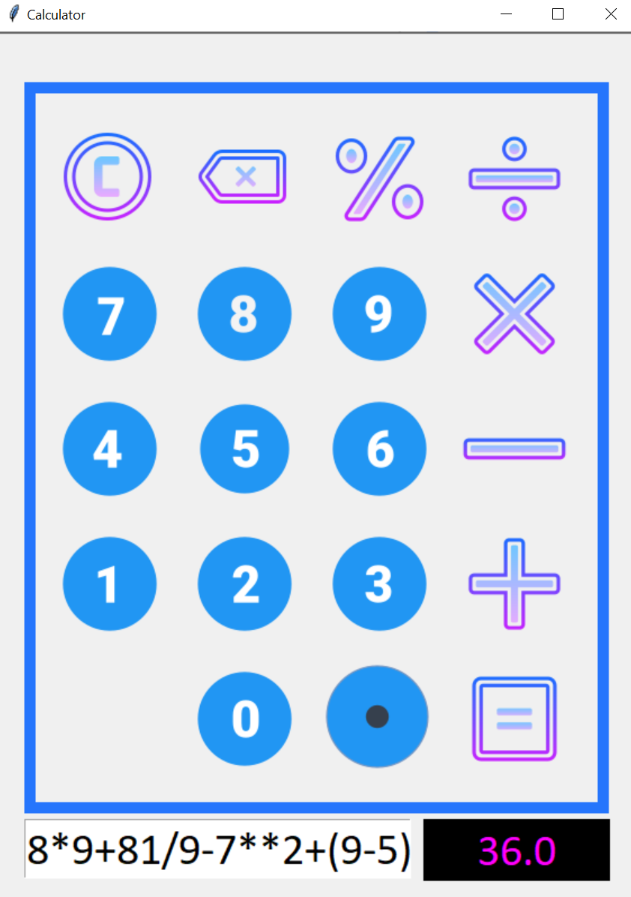

# Calculator GUI

**Simple GUI calculator made with Python and Tkinter.**

## Author

- [Suraj Kumar Giri](https://www.github.com/surajgirioffl)

## Screenshots

    &nbsp;&nbsp;&nbsp;
    

    

## Badges

